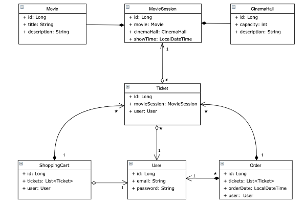

## 🎥 CINEMA APP 🎥

### 📄 Project description 
A simple RESTful application that allows registered users to purchase tickets for a specific movie session (movie, cinema hall, show time).
To purchase tickets, the user first adds them to the shopping cart, and then completes the order. This API supports 
authentication and registration. Access to the functionality of the API depends on the assigned role of the user. By default, API has two roles: ADMIN/USER.

### 📋 Project functionality 
- registration (ALL)
- view movies/cinema-halls (USER/ADMIN)
- view available movie sessions (USER/ADMIN)
- add tickets to the shopping cart (USER)
- view shopping cart (USER)
- complete the order (USER)
- view a history of orders (USER)
- find user by email (ADMIN)
- add new movie/cinema-hall (ADMIN)
- create/update/delete movie session (ADMIN)

### 📂 Project structure 
- Controller: to handle the HTTP requests and performs authentication.   
- Service layer : to communicate between the controller and the persistence layer. Contains all business logic.
- DAO layer: to perform the CRUD operations to persist data to DB
- Database Layer – Actual Database.

  ### DB structure
  

### ‍💻 Main technology stack 
Java 11, Spring Core, Spring Security, Spring Web MVC, Hibernate, MySQL, Tomcat, Maven

### 🚀 Getting Started 
1. To run the application you should install:
  * Java Development Kit (JDK) 11 or later.
  * Apache Maven 3.3.2 or later.
  * MySQL
  * TomCat 9.0.75
2. After installing the required software, clone the project from the GitHub repository. 
3. Update data in _resources/db.properties_ (JDBC driver, URL, user, password) to connect to your database.
4. Finally, run this project using Tomcat's local server (Artifacts for Deploy - war_exploded, Application context - "/").
  
     By default admin and user (name = "admin@i.ua", password = "admin123") will be added to your DB when program starts. 
     You can update this data in _config/DataInitializer_.

### 📄 List of available end-points:
-	POST: /register                     (ALL)
-   GET: /movies                    (USER/ADMIN)
-	GET: /cinema-halls              (USER/ADMIN)
-	GET: /movie-sessions/available  (USER/ADMIN)
-	POST: /movies                      (ADMIN)
-   POST: /cinema-halls                (ADMIN)
-	POST: /movie-sessions              (ADMIN)
-	PUT: /movie-sessions/{id}          (ADMIN)
-	DELETE: /movie-sessions/{id}       (ADMIN)
-	GET: /users/by-email               (ADMIN)
-	PUT: /shopping-carts/movie-sessions (USER)
-	POST: /orders/complete              (USER)
-	GET: /orders                        (USER)
-	GET: /shopping-carts/by-user        (USER)
